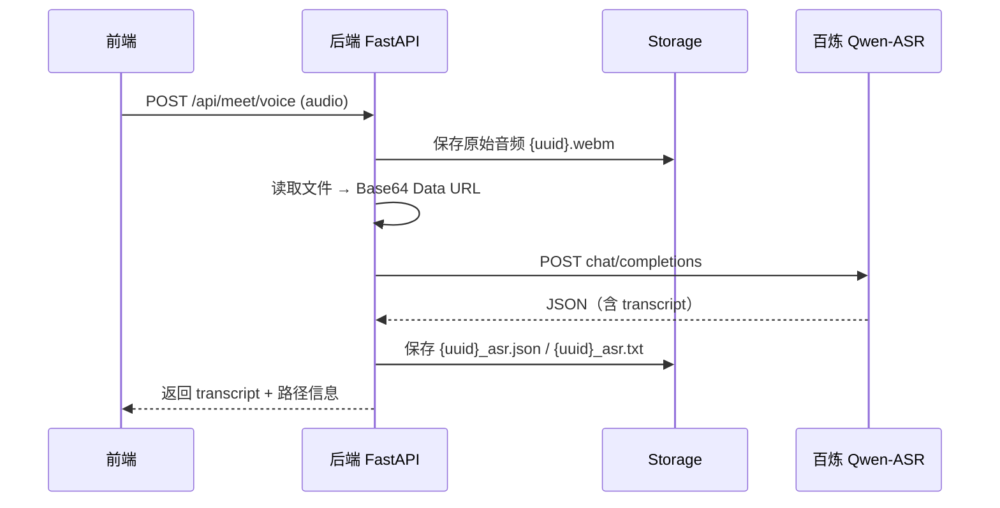

# 百炼平台接口文档（Meet 项目）

> 整理自阿里云百炼官方文档，供本项目后端 HTTP 调用参考。  
> 官方文档：[Qwen-ASR API 参考](https://help.aliyun.com/zh/model-studio/qwen-asr-api-reference)

---

## 1. 通用开发规范

### 1.1 认证方式

所有请求需在 Header 中携带 API Key：

```http
Authorization: Bearer {DASHSCOPE_API_KEY}
Content-Type: application/json
```

API Key 在 [百炼控制台](https://help.aliyun.com/zh/model-studio/get-api-key) 获取，**仅配置在后端 `.env` 文件中**，禁止写入前端或提交到 Git。

### 1.2 地域与 Base URL

| 地域 | OpenAI 兼容（推荐） | DashScope 同步 |
|------|---------------------|----------------|
| 中国内地（北京） | `https://dashscope.aliyuncs.com/compatible-mode/v1/chat/completions` | `https://dashscope.aliyuncs.com/api/v1/services/aigc/multimodal-generation/generation` |
| 国际（新加坡） | `https://dashscope-intl.aliyuncs.com/compatible-mode/v1/chat/completions` | `https://dashscope-intl.aliyuncs.com/api/v1/services/aigc/multimodal-generation/generation` |

本项目默认使用 **中国内地 OpenAI 兼容接口**。

### 1.3 调用约束

| 约束项 | 说明 |
|--------|------|
| 调用方式 | **HTTP REST**，不使用官方 SDK |
| 音频上传 | **Base64 Data URL**：`data:{mime};base64,{data}` |
| 音频大小 | Base64 编码后不超过 **10MB** |
| 音频时长 | `qwen3-asr-flash` 最长约 **5 分钟** |
| 代理 | 发起请求前清除进程内代理环境变量，`httpx` 使用 `trust_env=False` |

### 1.4 模型选型（本项目）

| 模型 | 接入方式 | 适用场景 |
|------|----------|----------|
| `qwen3-asr-flash` | OpenAI 兼容 / DashScope 同步 | 短音频实时识别（≤5 分钟）✅ **本项目使用** |
| `qwen3-asr-flash-filetrans` | DashScope 异步 | 长音频（≤12 小时），需公网 URL |

---

## 2. Qwen-ASR Flash（OpenAI 兼容 · HTTP）

### 2.1 接口信息

```http
POST {DASHSCOPE_BASE_URL}
```

默认：

```text
POST https://dashscope.aliyuncs.com/compatible-mode/v1/chat/completions
```

### 2.2 请求体（Base64 音频）

```json
{
  "model": "qwen3-asr-flash",
  "messages": [
    {
      "role": "user",
      "content": [
        {
          "type": "input_audio",
          "input_audio": {
            "data": "data:audio/webm;base64,XXXX..."
          }
        }
      ]
    }
  ],
  "stream": false,
  "asr_options": {
    "language": "zh",
    "enable_itn": false
  }
}
```

#### 字段说明

| 字段 | 类型 | 必填 | 说明 |
|------|------|------|------|
| `model` | string | 是 | 固定 `qwen3-asr-flash` |
| `messages` | array | 是 | 消息列表，User Message 必填 |
| `messages[].role` | string | 是 | 固定 `user` |
| `messages[].content` | array | 是 | 仅一组，`type` 为 `input_audio` |
| `messages[].content[].type` | string | 是 | 固定 `input_audio` |
| `messages[].content[].input_audio.data` | string | 是 | Base64 Data URL 或公网音频 URL |
| `stream` | boolean | 否 | 默认 `false`；`true` 为流式输出 |
| `asr_options` | object | 否 | ASR 扩展参数（非 OpenAI 标准字段） |
| `asr_options.language` | string | 否 | 语种，如 `zh`、`en`；混合语种勿指定 |
| `asr_options.enable_itn` | boolean | 否 | 逆文本标准化，默认 `false` |

#### Base64 Data URL 格式

```text
data:{MIME类型};base64,{Base64字符串}
```

常见 MIME：

| 格式 | MIME |
|------|------|
| WAV | `audio/wav` |
| MP3 | `audio/mpeg` |
| WebM | `audio/webm` |
| OGG | `audio/ogg` |
| M4A | `audio/mp4` |

> Base64 会增大约 33% 体积，请确保编码后 ≤ 10MB。

### 2.3 响应体（非流式）

```json
{
  "id": "chatcmpl-487abe5f-d4f2-9363-a877-xxxxxxx",
  "object": "chat.completion",
  "created": 1767683986,
  "model": "qwen3-asr-flash",
  "choices": [
    {
      "index": 0,
      "finish_reason": "stop",
      "message": {
        "role": "assistant",
        "content": "欢迎使用阿里云。",
        "annotations": [
          {
            "type": "audio_info",
            "language": "zh",
            "emotion": "neutral"
          }
        ]
      }
    }
  ],
  "usage": {
    "prompt_tokens": 42,
    "completion_tokens": 12,
    "total_tokens": 54,
    "seconds": 1,
    "prompt_tokens_details": {
      "audio_tokens": 42,
      "text_tokens": 0
    },
    "completion_tokens_details": {
      "text_tokens": 12
    }
  }
}
```

#### 关键响应字段

| 字段 | 说明 |
|------|------|
| `choices[0].message.content` | **识别文本**（本项目主要使用） |
| `choices[0].message.annotations` | 语种、情绪等元信息 |
| `usage.seconds` | 音频时长（秒） |
| `usage.total_tokens` | Token 消耗 |

### 2.4 错误响应

HTTP 非 2xx 时，响应体通常包含：

```json
{
  "error": {
    "message": "错误描述",
    "type": "invalid_request_error",
    "code": "..."
  }
}
```

---

## 3. 本项目后端配置（`.env`）

```env
# 百炼 / DashScope
DASHSCOPE_API_KEY=sk-your-api-key
DASHSCOPE_ASR_URL=https://dashscope.aliyuncs.com/compatible-mode/v1/chat/completions
BAILIAN_ASR_MODEL=qwen3-asr-flash
BAILIAN_ASR_LANGUAGE=zh
BAILIAN_ASR_ENABLE_ITN=false
BAILIAN_ASR_STREAM=false
BAILIAN_ASR_MAX_BASE64_MB=10
```

> 配置**仅从 `backend/.env` 读取**，不依赖操作系统环境变量。

---

## 4. 本项目调用流程



### 4.1 Storage 文件命名

| 文件 | 说明 |
|------|------|
| `{uuid}.webm` | 前端上传的原始音频 |
| `{uuid}_asr.json` | 百炼 ASR 完整响应 |
| `{uuid}_asr.txt` | 识别文本 |
| `{uuid}_slots.json` | DeepSeek 槽位提取 |
| `{uuid}_mcp.json` | 高德 MCP 完整日志 |
| `{uuid}_answer.json` | DeepSeek 回答生成 |
| `{uuid}_tts.json` | 百炼 TTS 元数据 |
| `{uuid}_tts.wav` | 合成语音文件 |

---

## 5. Qwen-TTS（HTTP 非流式）

### 5.1 接口

```http
POST https://dashscope.aliyuncs.com/api/v1/services/aigc/multimodal-generation/generation
Authorization: Bearer {DASHSCOPE_API_KEY}
Content-Type: application/json
```

### 5.2 请求体

```json
{
  "model": "qwen3-tts-flash",
  "input": {
    "text": "根据你们的位置，推荐在中关村附近碰面……",
    "voice": "Cherry",
    "language_type": "Chinese"
  }
}
```

### 5.3 响应（非流式）

```json
{
  "output": {
    "audio": {
      "url": "https://dashscope.oss-cn-beijing.aliyuncs.com/.../xxx.wav"
    },
    "finish_reason": "stop"
  }
}
```

后端会下载 `output.audio.url` 保存至 Storage，并以 Base64 返回前端播放。

### 5.4 本项目 `.env`

```env
BAILIAN_TTS_URL=https://dashscope.aliyuncs.com/api/v1/services/aigc/multimodal-generation/generation
BAILIAN_TTS_MODEL=qwen3-tts-flash
BAILIAN_TTS_VOICE=Cherry
BAILIAN_TTS_LANGUAGE_TYPE=Chinese
```

---

## 6. 完整链路

```text
上传音频 → ASR → DeepSeek槽位 → 高德MCP → DeepSeek回答 → 百炼TTS → 返回 audioBase64
```

---

## 7. 参考链接

- [Qwen-ASR API 参考（阿里云帮助中心）](https://help.aliyun.com/zh/model-studio/qwen-asr-api-reference)
- [非实时语音识别产品说明](https://help.aliyun.com/zh/model-studio/qwen-speech-recognition)
- [获取 API Key](https://help.aliyun.com/zh/model-studio/get-api-key)
